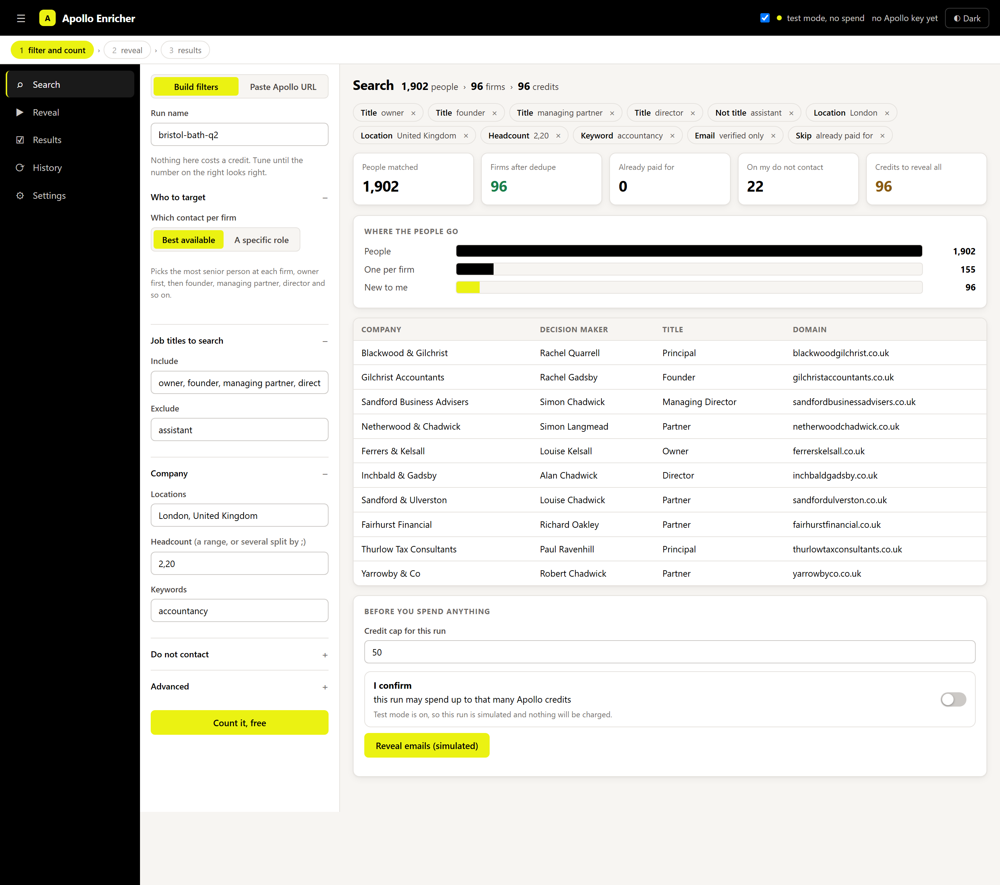
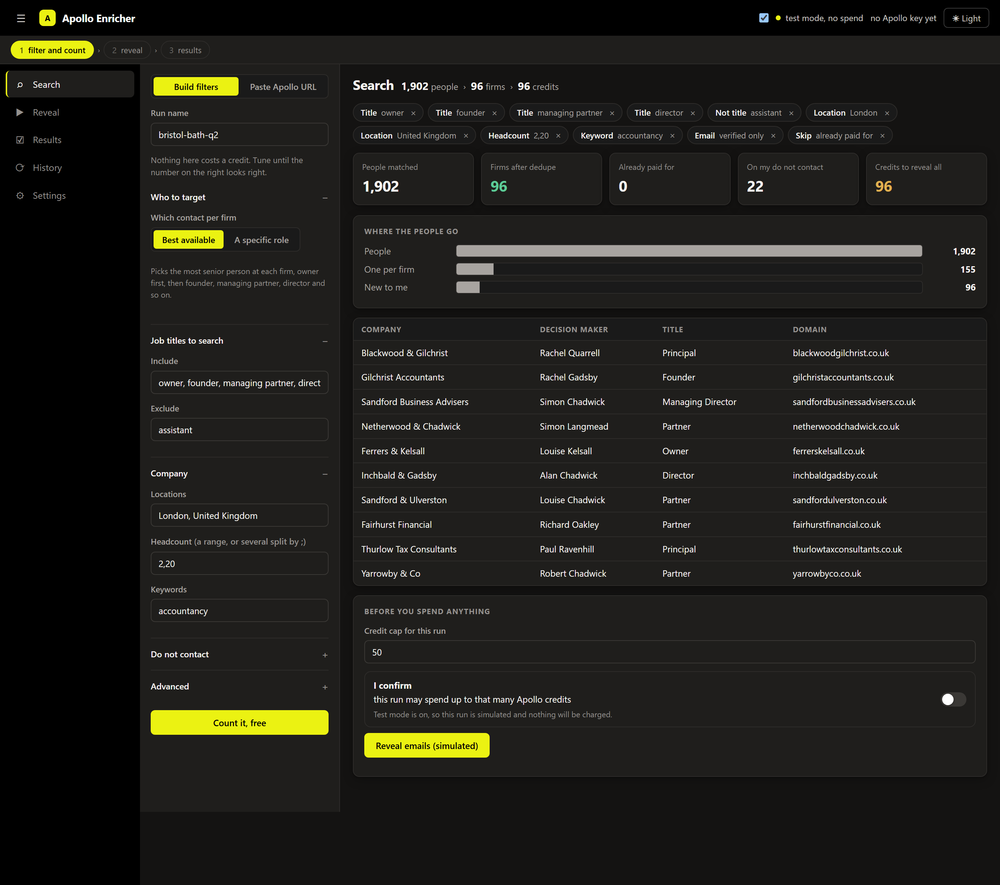
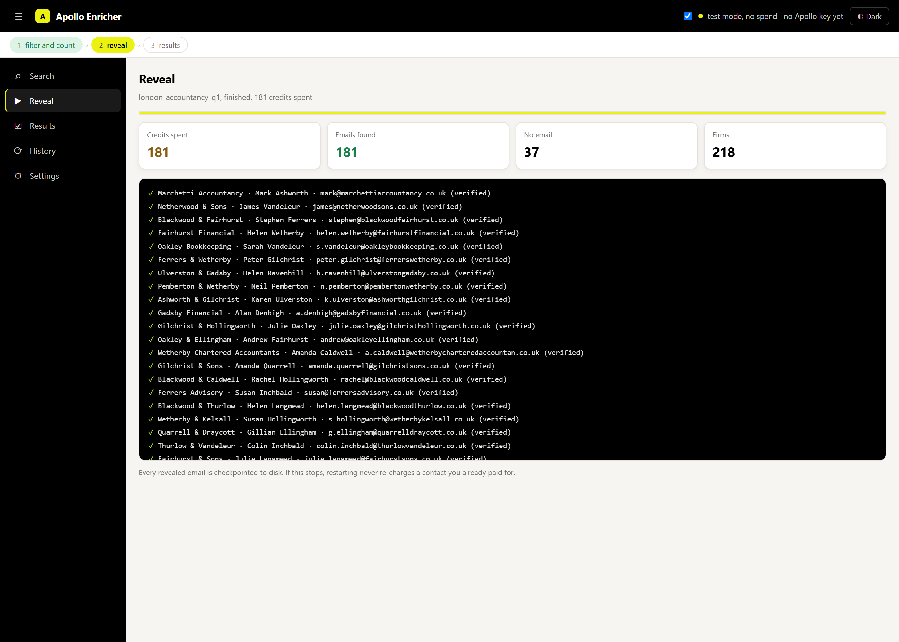

# Apollo Enricher

Every Apollo credit I spend buys a real firm I don't already have. That's the whole idea.

## Why I built it

On Apollo you pay a credit each time you reveal a verified email, and I was losing that money in two places.

The first is duplicates. One accountancy firm shows up three or four times, the owner, a partner, an office manager. Export the raw list and you're charged for each of them, even though you only ever need to reach one person at that firm.

The second is firms I already had. Re-run a similar search a month later and you pay all over again for companies sitting in my CRM.

Here's what that looked like in practice. Out of 2,500 credits I got 1,500 real firms and 1,000 duplicates, which were just different contacts at firms I'd already counted. A thousand credits gone for nothing new.

## How it stops that

Before it spends a single credit, it does two things.

**One decision maker per firm.** It groups results by company, and it's not fooled by naming, so "Smith & Co Ltd" and "Smith and Company" are treated as the same firm. Then it keeps only the most senior contact: owner first, then founder, managing partner, director, and so on. The others are kept as free backups rather than charged for.

**Skips firms I already own.** I point it at my existing leads and it strips those out up front, so I never pay twice for the same company.

**Remembers every contact it has already bought.** This one caught me out for a while. Resume only ever looked inside a single run, so someone revealed in January would be charged for again in February. It now indexes every past run and leaves those people out of the count entirely, and if one slips through it reuses the address it already has instead of buying it again.

In that 2,500 credit example, the thousand duplicate credits simply never get spent. They stay in my account and go towards a thousand more real firms instead. Same budget, more actual companies.

## Seeing the cost before paying it

This was the part I cared most about getting right.

There's a free preview. I enter a search and it tells me how many real firms I'll end up with and exactly what it'll cost in credits, with a 10 row sample, before anything is charged.

There's a hard credit cap. I set a maximum and it doesn't go past it, and it spends on the most senior contacts first so the budget goes to the best people.

And it's safe to stop. If a run gets interrupted, restarting never re-charges a contact that was already revealed.

That's the whole idea in one screen. Filters on the left, and on the right the count updating as I change them: 1,902 people collapsing to 88 firms once duplicates and the ones I already have are stripped out. It tells me the exact credit cost before anything is charged, and nothing is spent until I tick the confirm box.

I laid it out this way because it's how Apollo itself works. You tune filters and watch a number, rather than filling in a form and pressing submit to find out.

Dark works too:

## The app

**Search.** The two pane screen above, with two tabs: build the filters here, or paste an Apollo search URL and have them read out of it. Active filters show as chips you can pull off one at a time. Counting is free.

You also choose *which* contact you want per firm. By default it takes the most senior person, owner first. Switch it to a specific role and it only returns that role, so asking for finance directors gets you finance directors rather than whoever happens to outrank them.

**Reveal.** Spends credits, and only after a cap and an explicit confirmation. Emails come back one at a time in a live feed with a running counter and a stop button, so you can watch a run rather than stare at a spinner. It checkpoints as it goes.

There's a test mode in the header that simulates the whole reveal without calling Apollo, which is how I check a search behaves before paying for it.

**Results.** The leads, a title mix so I can sanity check who I actually got, hit rate, and a CSV download.

**History.** Every past run, reopenable and re-downloadable.

## Running it

Double-click **`start-app.bat`**. That's it. It installs anything missing, starts the server and opens the browser at `http://127.0.0.1:8000`.

There's also `backend/START_BACKEND.bat`, which is the same thing with auto-reload for when I'm editing the code. The API is browsable at `/docs` if you'd rather drive it directly.

First time through:

1. Settings tab, paste the Apollo master API key. It's saved to `backend/settings.json`, which is gitignored.
2. New search, name the run and set your filters. Hit preview. Free.
3. Check the number, set a credit cap, tick confirm, reveal.
4. Results tab, download the CSV.

The same steps over HTTP if you want to script it:

1. `POST /api/settings` with the key.
2. `POST /api/preview` with a name and either filters or an Apollo URL. Free.
3. `POST /api/enrich` with a name, `max_credits` and `confirmed: true`. This one spends credits, streams progress, and resumes without re-charging.
4. `GET /api/runs/{name}/export` to download the CSV.

| Method | Path | Cost |
|---|---|---|
| POST | /api/preview | free |
| POST | /api/enrich | credits |
| POST | /api/parse-url | free |
| GET | /api/runs, /api/runs/{name} | free |
| GET | /api/runs/{name}/export | free |
| GET/POST | /api/settings | free |

## Where it's at

The engine and the app are built and working. The backend is a FastAPI service wrapping the search, pick, enrich and suppression logic, and the UI is served by the same process, so it's one thing to start rather than two. The colours are Apollo's own, sampled from their site, in a light and a dark theme.

Still on my list: MillionVerifier integration for the addresses Apollo can't verify, and saved filter presets.

The firms in the screenshots are invented. I'm not putting real companies, directors or revealed addresses in a public repo.

`SPEC.md` has the full design if you want the detail.

## Safety, built into the engine rather than bolted on

- Dry run preview before any spend, and enrich won't move without `confirmed: true` and a credit cap.
- Resume works by person id, so an already revealed contact is never charged again.
- Checkpoints to disk every 10 reveals, and spends in seniority order so if it does stop early, it stopped on the right people.
- The API key is stored locally and gitignored, and the server only binds to 127.0.0.1.

The dedupe and suppression logic is in `backend/core/picker.py` and `backend/core/suppression.py` if you want to see how the grouping actually works.
