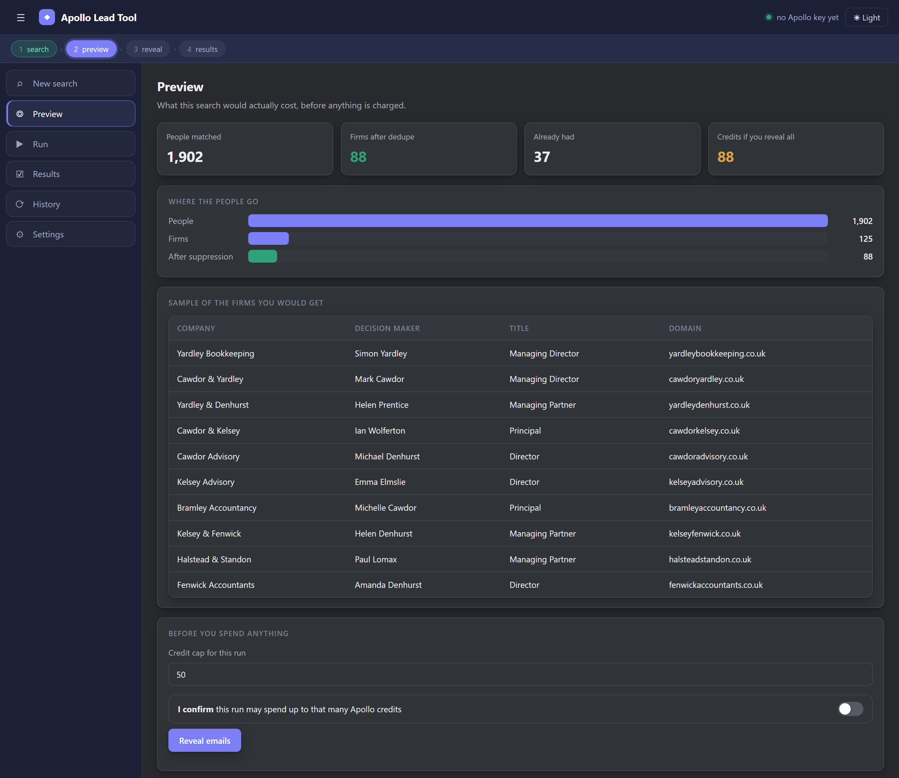
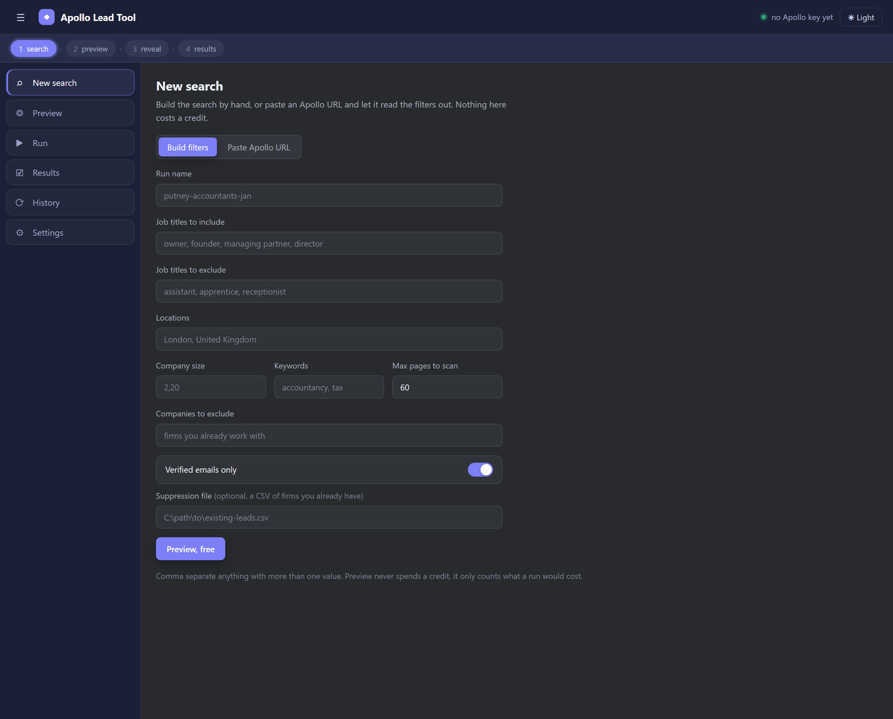
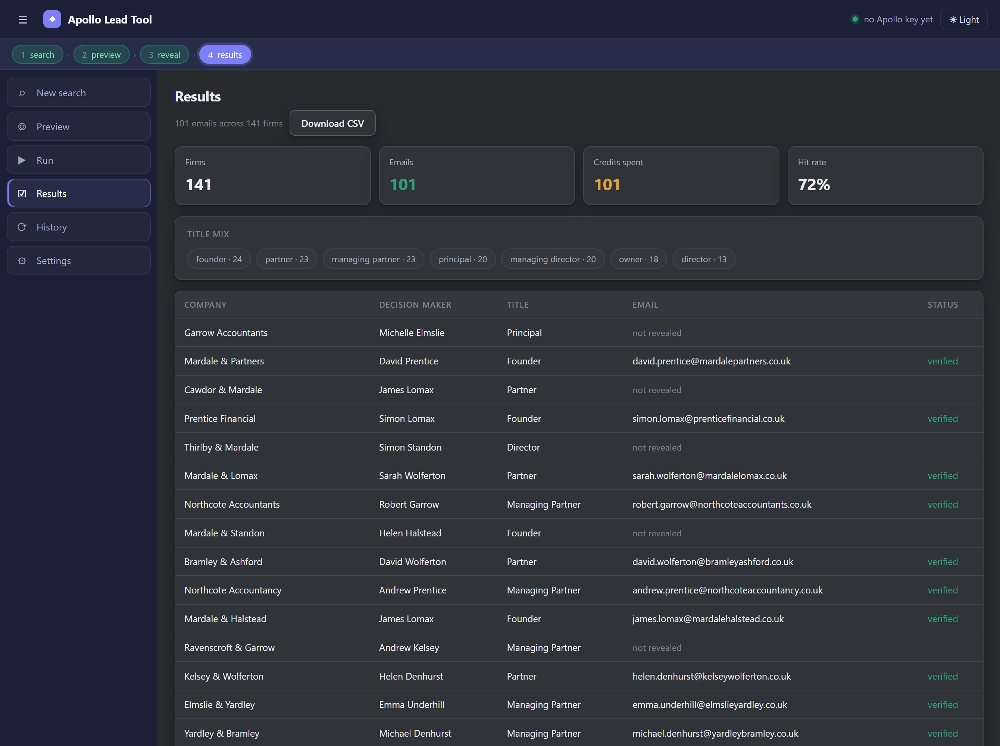
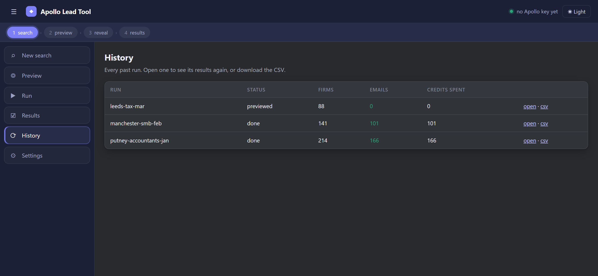

# Apollo Lead Tool

Every Apollo credit I spend buys a real firm I don't already have. That's the whole idea.

## Why I built it

On Apollo you pay a credit each time you reveal a verified email, and I was losing that money in two places.

The first is duplicates. One accountancy firm shows up three or four times, the owner, a partner, an office manager. Export the raw list and you're charged for each of them, even though you only ever need to reach one person at that firm.

The second is firms I already had. Re-run a similar search a month later and you pay all over again for companies sitting in my CRM.

Here's what that looked like in practice. Out of 2,500 credits I got 1,500 real firms and 1,000 duplicates, which were just different contacts at firms I'd already counted. A thousand credits gone for nothing new.

## How it stops that

Before it spends a single credit, it does two things.

**One decision maker per firm.** It groups results by company, and it's not fooled by naming, so "Smith & Co Ltd" and "Smith and Company" are treated as the same firm. Then it keeps only the most senior contact: owner first, then founder, managing partner, director, and so on. The others are kept as free backups rather than charged for.

**Skips firms I already own.** I point it at my existing leads and it strips those out up front, so I never pay twice for the same company.

In that 2,500 credit example, the thousand duplicate credits simply never get spent. They stay in my account and go towards a thousand more real firms instead. Same budget, more actual companies.

## Seeing the cost before paying it

This was the part I cared most about getting right.

There's a free preview. I enter a search and it tells me how many real firms I'll end up with and exactly what it'll cost in credits, with a 10 row sample, before anything is charged.

There's a hard credit cap. I set a maximum and it doesn't go past it, and it spends on the most senior contacts first so the budget goes to the best people.

And it's safe to stop. If a run gets interrupted, restarting never re-charges a contact that was already revealed.



That's the screen that matters. It's showing 1,902 people collapsing down to 88 firms after deduping and stripping out the ones I already have, and telling me the exact credit cost. Nothing is charged until I tick the confirm box.

## The app

Five screens, in the order you actually use them.

**New search.** Build the filters by hand, or paste an Apollo search URL and it reads the filters straight out of it.



**Preview.** Free. People, then firms, then what it would cost.

**Run.** Reveals emails one at a time with a live feed, a credit counter and a stop button. It checkpoints as it goes.

**Results.** The leads, a title mix so I can sanity check who I actually got, and a CSV download.



**History.** Every past run, reopenable and re-downloadable.



## Running it

```
cd backend
python -m pip install -r requirements.txt
START_BACKEND.bat
```

Then open `http://127.0.0.1:8000`. The API is also browsable at `/docs` if you'd rather drive it directly.

First time through:

1. Settings tab, paste the Apollo master API key. It's saved to `backend/settings.json`, which is gitignored.
2. New search, name the run and set your filters. Hit preview. Free.
3. Check the number, set a credit cap, tick confirm, reveal.
4. Results tab, download the CSV.

The same steps over HTTP if you want to script it:

1. `POST /api/settings` with the key.
2. `POST /api/preview` with a name and either filters or an Apollo URL. Free.
3. `POST /api/enrich` with a name, `max_credits` and `confirmed: true`. This one spends credits, streams progress, and resumes without re-charging.
4. `GET /api/runs/{name}/export` to download the CSV.

| Method | Path | Cost |
|---|---|---|
| POST | /api/preview | free |
| POST | /api/enrich | credits |
| POST | /api/parse-url | free |
| GET | /api/runs, /api/runs/{name} | free |
| GET | /api/runs/{name}/export | free |
| GET/POST | /api/settings | free |

## Where it's at

The engine and all five screens are built and working. The backend is a FastAPI service wrapping the search, pick, enrich and suppression logic, and the UI is served by the same process, so it's one thing to start rather than two.

Still on my list: MillionVerifier integration for the addresses Apollo can't verify, and saved filter presets.

The screenshots above are a demo dataset of invented firms, so the interface shows realistic volume without putting real companies or people in a public repo.

`SPEC.md` has the full design if you want the detail.

## Safety, built into the engine rather than bolted on

- Dry run preview before any spend, and enrich won't move without `confirmed: true` and a credit cap.
- Resume works by person id, so an already revealed contact is never charged again.
- Checkpoints to disk every 10 reveals, and spends in seniority order so if it does stop early, it stopped on the right people.
- The API key is stored locally and gitignored, and the server only binds to 127.0.0.1.

The dedupe and suppression logic is in `backend/core/picker.py` and `backend/core/suppression.py` if you want to see how the grouping actually works.
